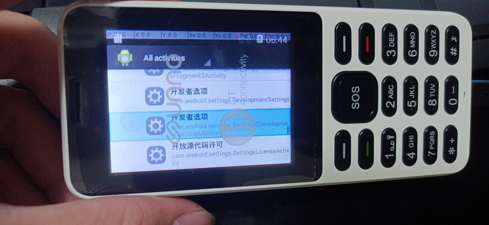

<h1>unno f3 开启第三方应用安装</h1>


本教程仅用于学习。
注意，搞机有风险，请谨慎操作，本人不为刷机导致的任意后果负责。

### 准备工作
- 下载右侧文件，并解压，得到三个文件


- 安装压缩包里的usb驱动（如有，也可不必）

latest_usb_driver_windows.zip

- 下载android platform-tools

[谷歌官网地址](https://developer.android.google.cn/studio/releases/platform-tools?hl=zh-cn)

### 步骤
- 手机关机
- 按住 "挂机键" 和 "#"号键，等待10秒左右，进入fastboot模式

进入后，会一直保持这个界面。


- 连接usb，cmd进入platform-tools文件夹，检查是否连接正确

`fastboot devices` 

如果能够看到设备列表，说明连接成功。


- 刷入rec

依然是在刚刚打开的cmd中，输入：
`fastboot flash recovery rec文件路径` 

这里提醒下，文件直接拖进cmd就可以直接得到路径。
当控制台显示 :
```
Sending...           OKEY
Writing...           OKEY
Finish. TotalTime: 1.3s 
```
表示刷入成功。 
接下来，长按关机

- 进入rec

手机关机状态下，按住 "挂机键" 和 "*"号键，等待10秒左右，进入rec模式。

界面如图所示：


选择第三个选项"wipe data/factory reset"，然后选择“yes”。

双清后会回到rec首页，这时候选择第二个“apply update from ADB”。


回到控制台，输入 "adb devices" ，如果展示出了：
```
xxx  sideload
```

说明连接成功，可以进行下一步。


- 刷入升级包 

在控制台，输入以下命令：
```
adb sideload update3.zip文件的路径
```
正常情况下，控制台会输出：
```
sending xxx  100%...
```
等到100% 之后，手机上会开始升级，这里我没有截图。等刷机完成。

按理说会自动重启，如果没有自动重启，那么观察日志，显示成功等字样后，自己手动关机再重启。

- 开启adb调试

开机后，到“应用文件夹” 这里，选择“Activity Launcher”，


在左上角选择 “All Activity”.
向下滚动，找到“设置”


然后找到设置里的子菜单：“开发者选项”



点击进入，就是熟悉的开发者设置界面，直接开启adb，然后点授权即可。


- 结束

adb开启之后，想要啥功能都可以自己操作，安装软件自然不在话下。
但是目前还没有获得root权限，尝试了很多应用，例如 360 超级root，百度一键root，kingroot等，都失败了，等一个大手子。。。


